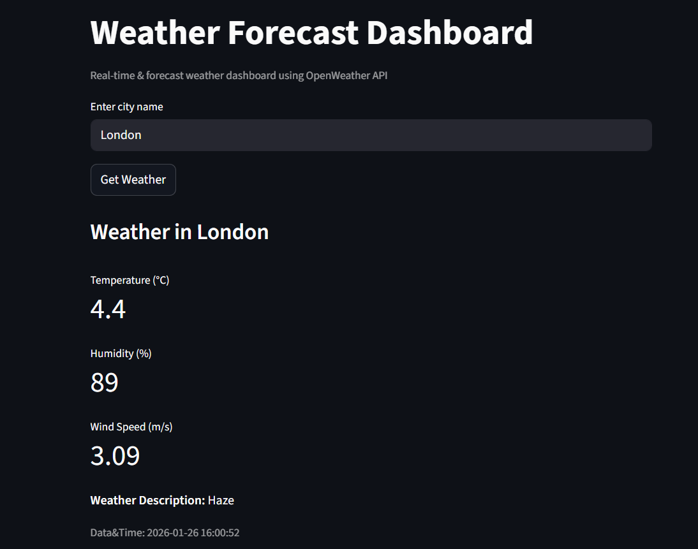
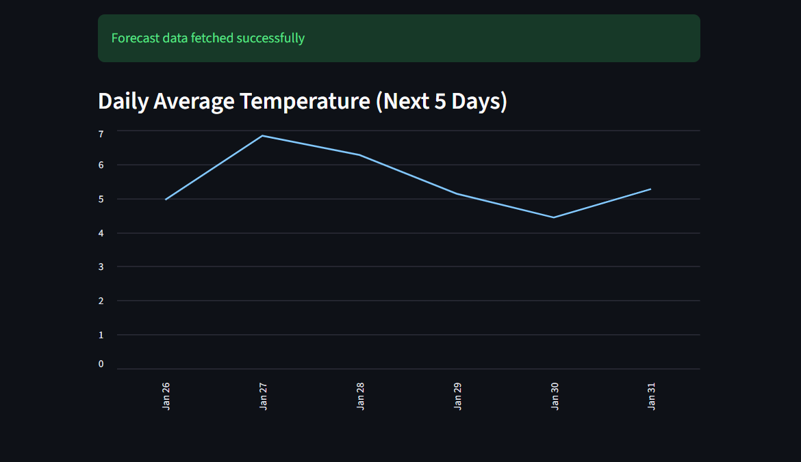

# Weather Forecast Dashboard

A real-time weather application built using **Streamlit** and the **OpenWeatherMap** API that enables users to search for any city and view current weather conditions through an interactive dashboard.

The application fetches live weather data and presents key metrics such as temperature, humidity, and conditions in a structured and user-friendly format, allowing quick and efficient access to weather insights.

---

## Demo

### Weather Dashboard


### 5-Day Temperature Forecast


---

## Features
- Search weather details by city name
- Real-time weather data retrieval using API
- Displays temperature, humidity, and weather conditions
- Interactive dashboard built with Streamlit
- Data processing and visualization for better readability
---

## Tech Stack
- Python
- Streamlit
- OpenWeatherMap API
- Requests
- Pandas

---

## How to Run Locally
1. Clone the repository:
   ```bash
   git clone https://github.com/rajini25-dot/Weather-Forecast-Dashboard.git
   cd Weather-Forecast-Dashboard
   ```

2. Install dependencies:
    ```bash
    pip install -r requirements.txt
    ```
    
3. Run the Streamlit app:
    ```bash 
    streamlit run app.py
    ```

---

## API Used 
- **OpenWeatherMap API**
https://openweathermap.org/api

Provides real-time weather data including temperature, humidity, and forecast information via REST API.

---

## Project Structure
```bash
app.py           → Main Streamlit application (UI + API integration)
requirements.txt → Project dependencies
assets/          → Screenshots for README demo
README.md        → Project documentation
```

## Future Improvements
- Add extended (5–7 day) weather forecast
- Improve UI with enhanced charts and icons
- Implement error handling for invalid inputs
- Add location-based auto-detection

